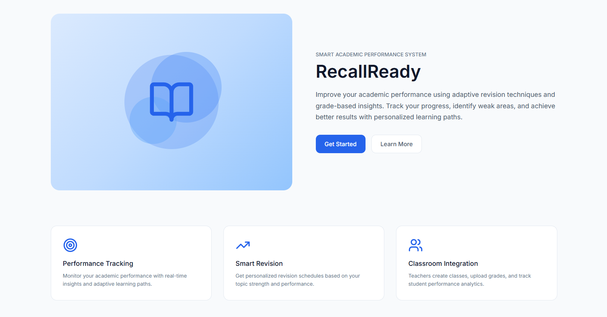
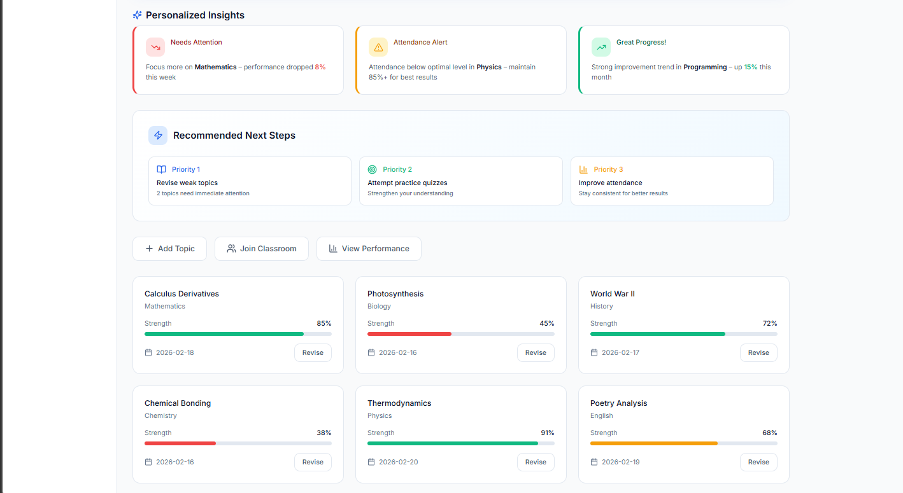
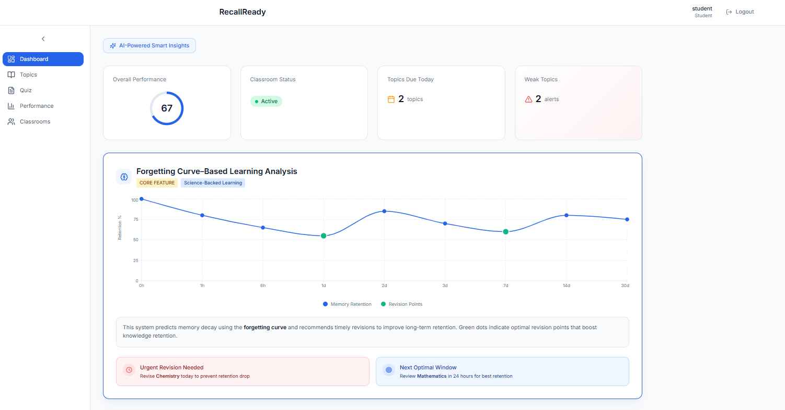
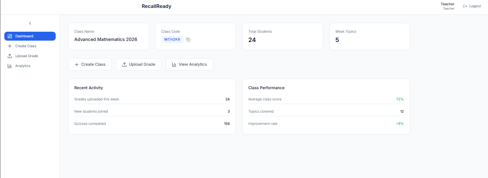
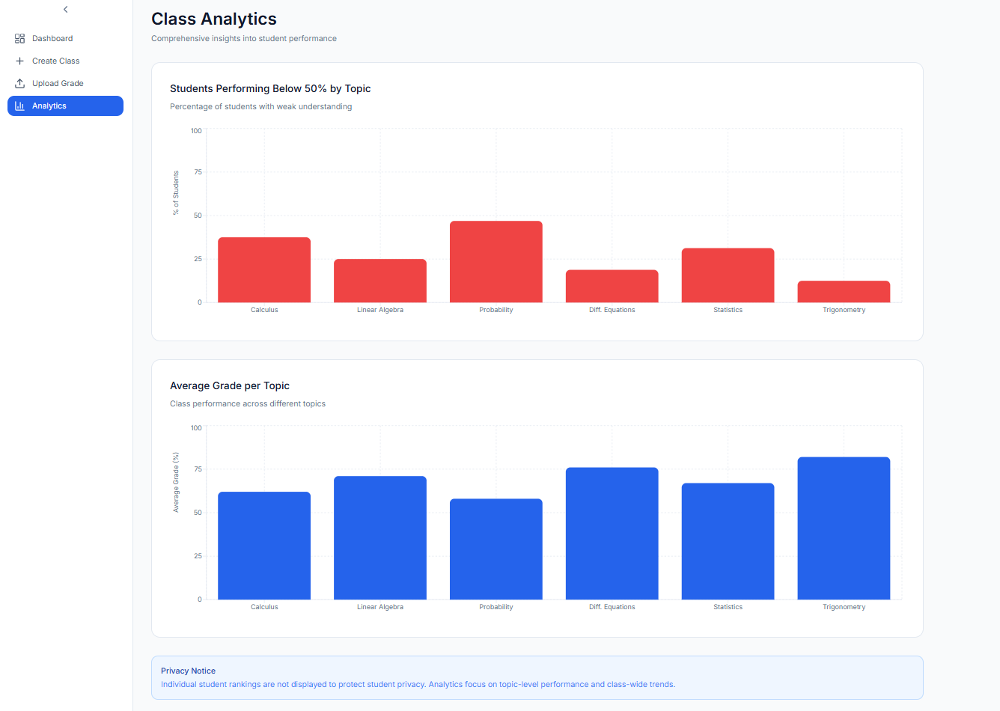

# Smart Academic Performance System

## Team-Based Hackathon Submission  
Domain: AI in Education & Skilling

---

## Important Note
This repository represents a **high-fidelity prototype** of our proposed system.  
The current version focuses on user flow, logic design, and system architecture demonstration.  
Full technical implementation is planned for future development.

---

## Problem Statement
Students tend to forget newly learned concepts over time if revision is not done strategically. Traditional systems do not account for memory decay, leading to poor retention, inefficient study patterns, and last-minute cramming.

Additionally, students often feel pressured or judged when performance tracking is highly individualized.

---

## Our Solution
Smart Academic Performance System is a web-based prototype that leverages the **Forgetting Curve principle** to improve long-term knowledge retention.

The system:
- Identifies topics likely to be forgotten
- Recommends smart revision intervals
- Tracks improvement after revision
- Provides class-level insights for teachers — anonymously

---

## Core Concept: Forgetting Curve
The Forgetting Curve explains how information fades over time without reinforcement.

Our system uses this principle to:
- Detect high-risk topics
- Schedule optimal revision reminders
- Reinforce learning at scientifically aligned intervals
- Improve retention without increasing study load

---

## Key Features

### Student Side
- Performance dashboard  
- Forgetting Curve–based revision alerts  
- Personalized revision roadmap  
- Progress tracking after revision  

### Teacher Side (Privacy-First)
- Anonymous dashboard  
- Class-level weak topic insights  
- Number of students struggling per topic (no names shown)  
- Overall retention trends  

This ensures students do not feel monitored or judged while still enabling teachers to make informed academic decisions.

---

## Prototype
A high-fidelity UI/UX prototype has been created using Figma to demonstrate the complete workflow.

🔗 **Figma Prototype Link:**  
https://www.figma.com/make/WNQbTuUpEYiShbLCrhsQtZ/Smart-Academic-Performance-System?fullscreen=1&t=SURrDR2SGbIMFksw-1

🎥 **Demo Video:**  
The demo video has been submitted separately through the hackathon submission form.

---

## Intelligence Component (Conceptual)
- Rule-based memory decay modeling using the Forgetting Curve  
- Topic risk classification based on time gaps and performance  
- Intelligent revision recommendations  
- Privacy-preserving class analytics  

(Note: AI enhancement and full backend integration are planned for future implementation.)

---

## Technology Stack (Prototype-Based)
- UI/UX Design: Figma  
- Frontend (Planned): HTML, CSS, JavaScript  
- Logic Modeling: JavaScript & Python  
- Version Control: Git & GitHub  
---
## 📸 Project Screenshots

### Landing Page

### Student Dashboard

### Forgetting Curve Analysis

### Teacher Dashboard

### Anonymous Class-Level Analytics

---

## Impact
- Reduces learning loss  
- Encourages consistent revision habits  
- Improves long-term academic retention  
- Supports teachers without compromising student privacy  
- Scalable for institutions  

---

## Future Scope
- Adaptive Forgetting Curve per student  
- Full-stack implementation  
- AI-enhanced retention prediction  
- Mobile revision reminders  
- LMS integration  
